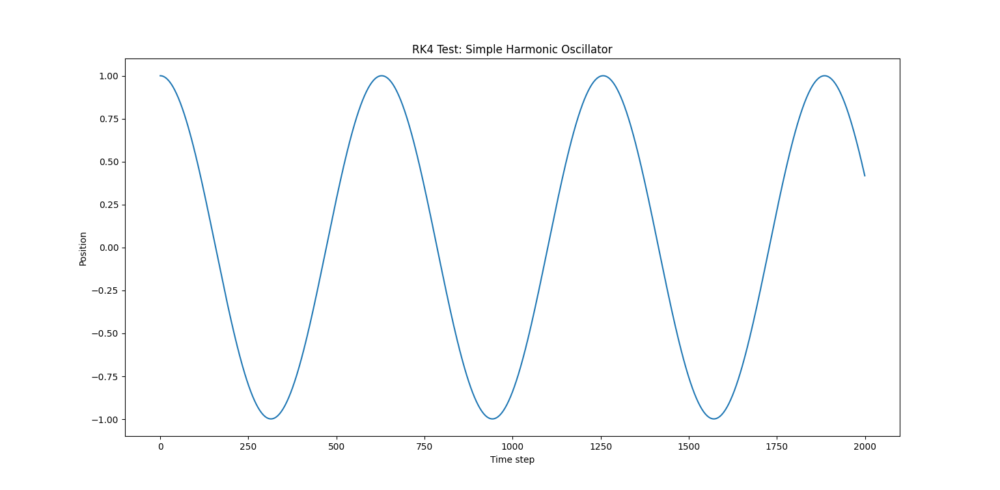
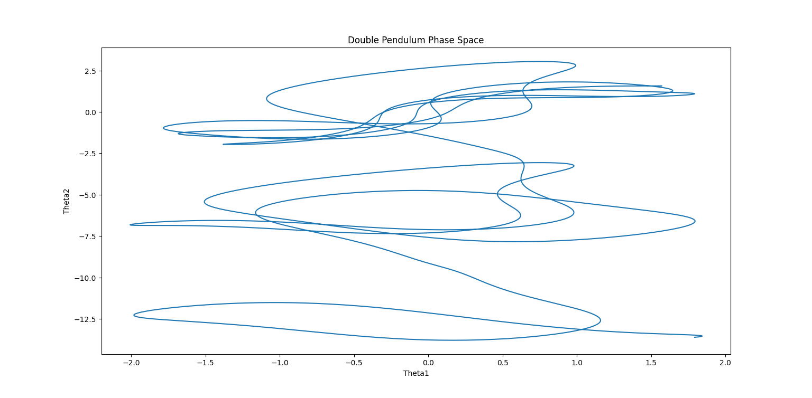
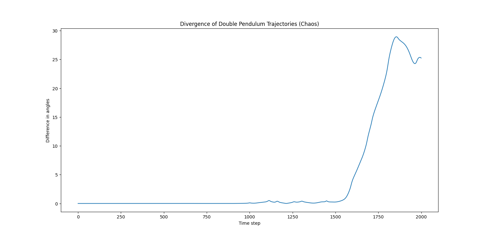
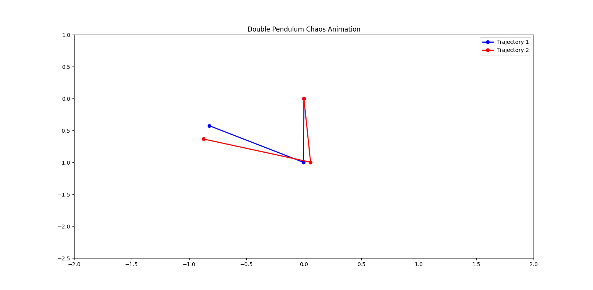
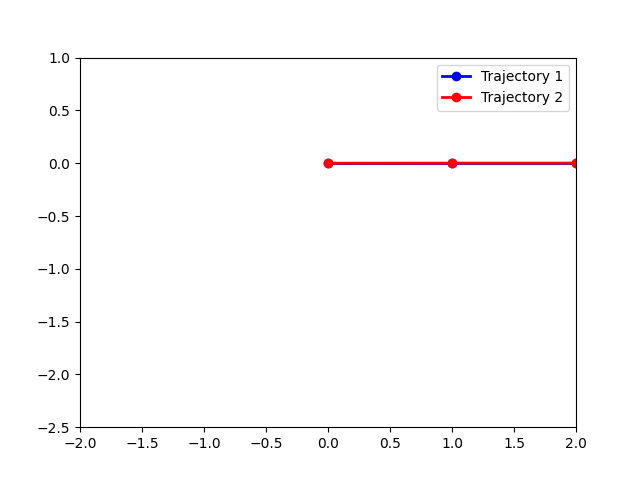

# Chaotic Systems & Sensitivity  
**Project Option 3 – Double Pendulum / Lorenz Attractor**  
*Classical + Nonlinear Physics | Chaos & Sensitivity Analysis*

---

## Overview

This project explores how **deterministic classical systems** can become **unpredictable** due to **exponential sensitivity to initial conditions**. Using the **double pendulum** as a canonical chaotic system, the work demonstrates how even tiny differences in starting conditions lead to dramatically different trajectories, illustrating the core ideas of chaos and limits of prediction.

**Key Highlights:**

- Simulated a double pendulum system using precise RK4 integration.  
- Tested sensitivity to initial conditions by changing angles by `0.001 rad`.  
- Generated **phase-space plots, divergence plots, and animations** to illustrate chaotic behavior.  
- Quantified separation between trajectories to demonstrate **Lyapunov-like exponential growth**.  

---

## Project Layout

chaotic-systems-sensitivity/
│
├── README.md
├── requirements.txt
├── .gitignore
├── src/
├── outputs/
└── supplementary/


> Code, outputs, and supplementary frames are clearly separated.

---

## Project Phases & Deliverables

### Phase 1 — Physical Model
- Derived equations of motion for the double pendulum.
- Set parameters: length, mass, gravity.
- **Deliverable:** Markdown/PDF section explaining the deterministic model.

### Phase 2 — Numerical Solver Validation
- Implemented RK4 solver and validated with a simple pendulum.
- Checked energy conservation and Euler method failure.
- **Deliverable:**  


### Phase 3 — Baseline Double Pendulum
- Ran one chaotic trajectory to visualize irregular motion.
- **Deliverable:**  


### Phase 4 — Sensitivity Experiment
- Simulated two trajectories with Δθ = 0.001.  
- Observed divergence over time.
- **Deliverable:**  


### Phase 5 — Quantifying Chaos
- Calculated separation δ(t) between trajectories.  
- Plotted ln(δ(t)) vs time to show exponential growth.
- **Deliverable:**  


### Phase 6 — Limits of Prediction
- Generated animated GIF showing both pendulums initially moving together, then diverging.  
- **Deliverable:**  


---

## Explanation

- Pendulums follow nearly identical paths initially.  
- Tiny differences in initial conditions grow exponentially (**nonlinear dynamics**).  
- Phase-space plots and divergence graphs confirm sensitivity.  
- System remains deterministic; unpredictability arises from **exponential sensitivity**, not randomness.

---

## Conclusions

1. **Deterministic systems can be unpredictable.**  
   Small initial differences lead to large divergences.

2. **Numerical methods matter.**  
   RK4 is stable; Euler fails over long times.

3. **Visual intuition is powerful.**  
   Phase-space plots and animations communicate chaos clearly.

4. **Limits of prediction are fundamental.**  
   Exact future states cannot be predicted beyond a short horizon.

---

## Reproducibility

```bash
# Install dependencies
pip install -r requirements.txt

# Validate RK4 solver
python src/test_rk4.py

# Run baseline simulation
python src/run_double_pendulum.py

# Compute divergence
python src/compute_divergence.py

# Animate pendulum motion
python src/animate_double_pendulum.py
